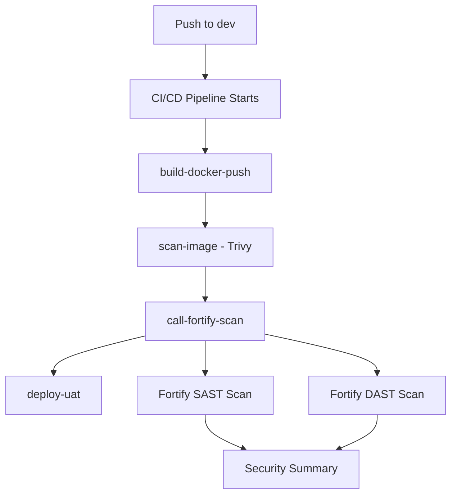

# GitHub Workflows Setup Guide

This guide explains how to set up the CI/CD pipeline with integrated Fortify security scanning using the `call-build` pattern.

## Files Created

### 1. `fortify-security-scan.yml` (Reusable Workflow)
- **Location**: Root directory (move to `.github/workflows/` after setup)
- **Type**: Reusable workflow that can be called from other workflows
- **Purpose**: Performs SAST and DAST security scans using Fortify ScanCentral

### 2. `ci-cd-updated.yml` (Updated CI/CD Pipeline)
- **Location**: Root directory (replace existing `.github/workflows/ci-cd.yml`)
- **Type**: Main CI/CD pipeline with integrated security scanning
- **Purpose**: Builds, scans, and deploys the application

## Setup Instructions

### Step 1: Move Files to Correct Locations

```bash
# Move the reusable Fortify workflow to the workflows directory
mv fortify-security-scan.yml .github/workflows/

# Replace the existing CI/CD workflow
mv ci-cd-updated.yml .github/workflows/ci-cd.yml
```

### Step 2: Configure GitHub Secrets

Add the following secrets to your GitHub repository:

1. Go to **Settings** → **Secrets and variables** → **Actions**
2. Add these repository secrets:

```
FORTIFY_SCANCENTRAL_URL=https://your-fortify-server.com
FORTIFY_TOKEN=your-fortify-api-token
AWS_ACCESS_KEY_ID_UAT=your-aws-access-key
AWS_SECRET_ACCESS_KEY_UAT=your-aws-secret-key
```

## How the `call-build` Pattern Works

### Reusable Workflow (`fortify-security-scan.yml`)

```yaml
name: Fortify Security Scan (Reusable)

on:
  workflow_call:
    inputs:
      image_name:
        description: 'Docker image name to scan'
        required: true
        type: string
      docker_registry:
        description: 'Docker registry URL'
        required: true
        type: string
      aws_region:
        description: 'AWS region'
        required: true
        type: string
    secrets:
      FORTIFY_SCANCENTRAL_URL:
        description: 'Fortify ScanCentral URL'
        required: true
      FORTIFY_TOKEN:
        description: 'Fortify authentication token'
        required: true
      # ... other secrets
```

### Calling the Workflow (`ci-cd.yml`)

```yaml
# Call Fortify Security Scan Workflow
call-fortify-scan:
  needs: [build-docker-push, scan-image]
  if: github.ref == 'refs/heads/dev'
  uses: ./.github/workflows/fortify-security-scan.yml
  with:
    image_name: ${{ env.IMAGE_NAME }}
    docker_registry: ${{ env.DOCKER_REGISTRY }}
    aws_region: ${{ env.AWS_REGION }}
  secrets:
    FORTIFY_SCANCENTRAL_URL: ${{ secrets.FORTIFY_SCANCENTRAL_URL }}
    FORTIFY_TOKEN: ${{ secrets.FORTIFY_TOKEN }}
    AWS_ACCESS_KEY_ID_UAT: ${{ secrets.AWS_ACCESS_KEY_ID_UAT }}
    AWS_SECRET_ACCESS_KEY_UAT: ${{ secrets.AWS_SECRET_ACCESS_KEY_UAT }}
```

## Workflow Flow



## Key Benefits of the `call-build` Pattern

### 1. **Reusability**
- The Fortify workflow can be called from multiple pipelines
- Easy to maintain and update security scanning logic
- Consistent security scanning across different projects

### 2. **Clean Separation**
- Security scanning logic is isolated in its own workflow
- Main CI/CD pipeline remains focused on build/deploy
- Clear dependencies and job relationships

### 3. **Parameter Passing**
- Inputs allow customization of scan parameters
- Secrets are properly passed through the workflow chain
- Environment-specific configurations

### 4. **Job Dependencies**
- `call-fortify-scan` depends on `build-docker-push` and `scan-image`
- `deploy-uat` depends on all previous jobs including `call-fortify-scan`
- Ensures proper sequencing of operations

## Workflow Jobs

### Main CI/CD Pipeline Jobs:
1. **`build-docker-push`** - Builds and pushes Docker image to ECR
2. **`scan-image`** - Runs Trivy vulnerability scan on the image
3. **`call-fortify-scan`** - Calls the reusable Fortify security scan workflow
4. **`deploy-uat`** - Deploys to UAT environment (only on dev branch)

### Fortify Security Scan Jobs:
1. **`fortify-sast-scan`** - Static Application Security Testing
2. **`fortify-dast-scan`** - Dynamic Application Security Testing
3. **`security-summary`** - Generates comprehensive security report

## Security Thresholds

### SAST (Static Analysis)
- **Critical**: 0 (fails build)
- **High**: 5 (fails build)
- **Medium/Low**: Reported only

### DAST (Dynamic Analysis)
- **Critical**: 0 (fails build)
- **High**: 3 (fails build)
- **Medium/Low**: Reported only

## Branch Restrictions

- **Fortify scans**: Only run on `dev` branch
- **UAT deployment**: Only runs on `dev` branch
- **Build and Trivy scan**: Run on both `dev` and `master` branches

## Artifacts Generated

- **`trivy-report`**: Trivy vulnerability scan results
- **`fortify-sast-results`**: SAST scan results (.fpr file)
- **`fortify-dast-results`**: DAST scan results (.fpr file)
- **`deployment-manifest`**: Kubernetes deployment manifest

## Troubleshooting

### Common Issues

1. **Workflow not found**
   - Ensure `fortify-security-scan.yml` is in `.github/workflows/`
   - Check the path in the `uses` statement

2. **Secrets not available**
   - Verify all required secrets are configured
   - Check secret names match exactly

3. **Scan failures**
   - Review Fortify server connectivity
   - Check scan thresholds and adjust if needed
   - Verify application deployment for DAST testing

### Debugging

- Check GitHub Actions logs for detailed error messages
- Download artifacts to view scan results
- Use Fortify SSC for detailed security analysis

## Customization

### Adjusting Security Thresholds
Edit the threshold values in `fortify-security-scan.yml`:

```yaml
# SAST thresholds
if [ "$CRITICAL_COUNT" -gt 0 ]; then
  echo "❌ SAST scan failed: $CRITICAL_COUNT critical issues found"
  exit 1
elif [ "$HIGH_COUNT" -gt 5 ]; then  # Change this number
  echo "⚠️ SAST scan warning: $HIGH_COUNT high issues found"
  exit 1
fi
```

### Adding More Inputs
Add new inputs to the reusable workflow:

```yaml
inputs:
  new_parameter:
    description: 'New parameter description'
    required: false
    type: string
    default: 'default-value'
```

## Support

For issues with the workflow setup:
1. Check GitHub Actions documentation
2. Review workflow logs
3. Verify secret configurations
4. Contact your Fortify administrator
